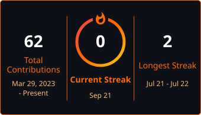
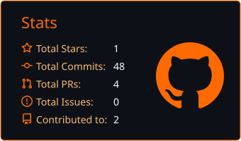

  
    
  
<strong>Software Engineering · Full-Stack · Testing & Quality · Cybersecurity & Networks · Systems Automation</strong>

  
📍 Kielce, Poland

  

    
    
    
  

  

## 👨‍💻 About Me

I design, build, and test reliable web and desktop applications while working across computer networks, IoT devices, system configuration, and process automation. With an engineering degree and a security-first mindset, I connect software development, cybersecurity, and infrastructure to create resilient, maintainable solutions.

- **Core Focus:** Full-stack applications, asynchronous APIs, automated testing, systems automation, and secure networked environments.
- **Engineering Approach:** Clear architecture, practical security, observability, and quality built into every stage of delivery.
- **Beyond Software:** Microcontrollers and IoT devices, soldering, controller repair, and hands-on hardware experimentation.

## 🛠️ Technologies & Tools

> The technologies below include tools I use, have worked with previously, or am actively exploring.

  

### Languages

    
     

### Backend & API

    
     

### Frontend & Desktop

     
  

### Databases & Machine Learning

    

### DevOps, Testing & Platforms

       
      

### Tools & Environments

     
    
   

> **Currently learning:** Rust, Next.js, Nuxt.js, Three.js, and TresJS.

## 🚀 Featured Repositories

### 🅿️ Smart Parking Management Application

> Private · Engineering thesis

- **Architecture:** Full-stack platform for managing single- and multi-level parking facilities, centered on an asynchronous **FastAPI** REST API with **PostgreSQL**, **SQLAlchemy 2.0**, **AsyncPG**, and **Pydantic**.
- **Security:** JWT authentication, Role-Based Access Control, bcrypt password hashing, system logging, and OpenAPI documentation.
- **Product Experience:** **React** and **TypeScript** SPA with an interactive 2D parking map, layout editor, reservations, payments, responsive mobile views, and dedicated interfaces for drivers, administrators, and service technicians.
- **Recommendation Engine:** Filters spaces by availability and permissions, calculates Euclidean distance within each floor, and applies Dijkstra's algorithm to transitions between floors.
- **Quality:** 352 backend tests consisting of 140 unit, 114 integration, and 98 functional tests built with **pytest**, **pytest-asyncio**, and **HTTPX**.

The application was developed as my engineering thesis and received a distinction. Its source code remains private, so this section presents the architecture and engineering scope.

### 📦 [WingetUpdater](https://github.com/Zalesny123/WingetUpdater)

> Public · MIT · PowerShell · [Release v1.1.0](https://github.com/Zalesny123/WingetUpdater/releases/tag/v1.1.0)

- **Implementation:** Windows GUI that simplifies reviewing and controlling updates from Windows Package Manager.
- **Workflow:** Refreshes package sources, supports selective updates, and processes them through a queue with progress tracking and cancellation.
- **Safety:** Maintains a persistent skip list and includes a mock mode for testing the complete workflow without modifying system state.
- **Quality:** Runs **Pester** tests and **PSScriptAnalyzer** checks in GitHub Actions on Windows PowerShell 5.1 and PowerShell 7.
- **Delivery:** Publishes a ready-to-use ZIP package with SHA256 checksums and detailed command logging.

[Repository](https://github.com/Zalesny123/WingetUpdater) · [Latest release](https://github.com/Zalesny123/WingetUpdater/releases/tag/v1.1.0)

## 📈 Stats & Activity

  

  

  
  

  

